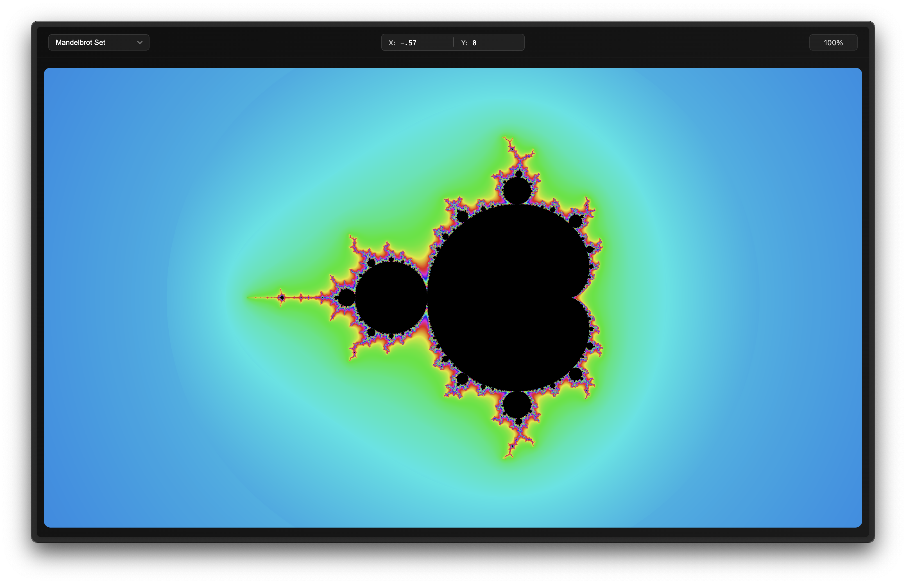
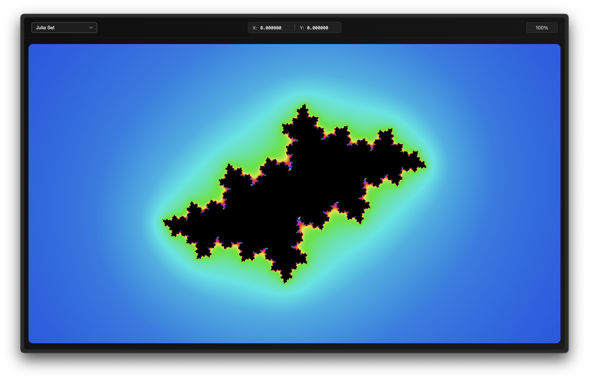
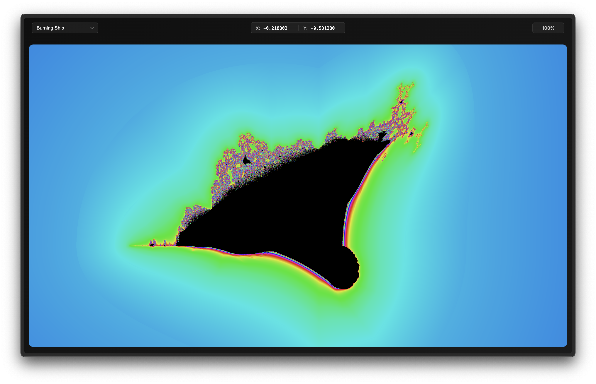

# Frak

<div align="center">
   
</div>

Frak is a Rust to WebAssembly fractal renderer. You can render a few different fractals, such as the Mandelbrot set, Julia set, and Burning Ship fractal. You can zoom and pan around the fractal as well.

You can view the live demo [here](https://durocodes.github.io/frak/).

> [!WARNING]
> The demo doesn't work very well on mobile, it's best to view it on a desktop.

## Screenshots

| Mandelbrot                             | Julia                        | Burning Ship                               |
| -------------------------------------- | ---------------------------- | ------------------------------------------ |
|  |  |  |

## Installation

You can build Frak to WebAssembly using the `./build.sh` script. You'll need to have [wabt](https://github.com/WebAssembly/wabt) installed for `wasm-strip` and `wasm-opt`.

```bash
git clone https://github.com/durocodes/frak
cd frak
./build.sh
```

Then, you can serve the `./www` directory using a static file server, such as `http-server`:

```bash
npm install -g http-server
http-server ./www
```

Then you can view the demo at `http://localhost:8080`.
